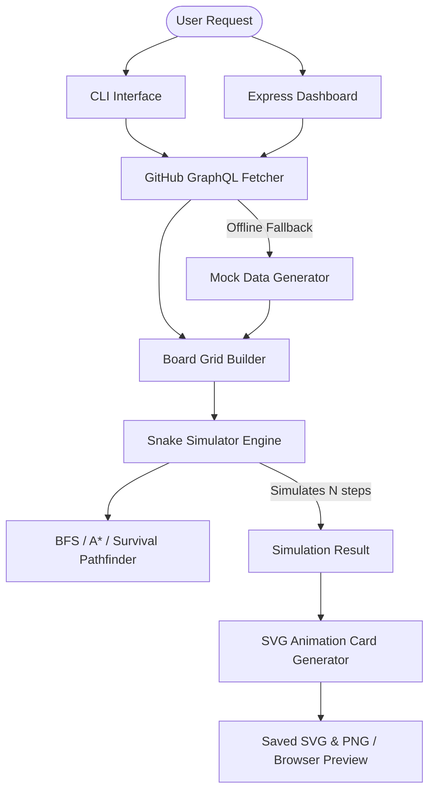

# GitSnake Pro Architecture

This document details the underlying technical architecture and algorithms behind **GitSnake Pro**.

---

## System Flow Overview



---

## 1. GitHub Contribution Fetcher (`src/api/github.ts`)

### GraphQL Query Schema
The fetcher sends a single POST request to `https://api.github.com/graphql` to query the GitHub user profile for their contribution history.
```graphql
query($login: String!) {
  user(login: $login) {
    contributionsCollection {
      contributionCalendar {
        totalContributions
        weeks {
          contributionDays {
            color
            contributionCount
            date
            weekday
          }
        }
      }
    }
  }
}
```

### Mock Data Fallback
If the user provides no `GITHUB_TOKEN` or is offline, the fetcher invokes `generateMockContributions`. This builds a standard 53-week grid and uses weighted random distribution (biased toward lower contributions on weekends and standard levels on weekdays) to generate a realistic and visual contribution matrix.

---

## 2. Board Grid & Pathfinding (`src/engine/`)

### Board Representation (`board.ts`)
The grid is modeled as an array of columns: `Cell[][]` of dimensions $53 \times 7$. Each cell coordinates $(x, y)$ map to column index (weeks) and row index (weekday).
- **Visited/Eaten**: Tracks whether the snake has eaten a specific contribution cell.
- **IsFood**: Tracks the current active food target.

### Pathfinding Logic (`pathfinding.ts`)
The snake must eat only cells that contain contributions (i.e. `contributionCount > 0`).

1. **A\* Pathfinder (Primary)**:
   - Finds the shortest path to the current food cell.
   - Heuristic function: Manhattan Distance:
     $$h(n) = |n.x - \text{target}.x| + |n.y - \text{target}.y|$$
   - Treats the snake's body segments (except the tip of the tail) as solid obstacles.
2. **BFS Pathfinder (Secondary)**:
   - Used when A\* fails, or as a general pathfinder for simple paths.
3. **Survival / Fallback Routing**:
   - **Tail-Following**: If the target food is unreachable, the snake attempts to find a path to its own tail tip. Since the tail tip moves forward every step, following it guarantees the snake will not trap itself.
   - **Flood-Fill Open Space Heuristic**: If tail-following fails, the pathfinder inspects all valid adjacent neighbors and executes a Breadth-First search to count the number of reachable empty cells. It chooses the direction that leads to the **largest open area**, ensuring it does not enter small pockets or dead ends.

---

## 3. SVG Generation Mechanics (`src/svg/`)

GitSnake Pro generates a single, self-contained SVG that requires **no runtime JavaScript** and **no external images (GIFs)**.

### CSS Keyframe Animations
The generator translates the simulation history into static CSS keyframes embedded in the `<style>` tag of the SVG:
- **`head-motion`**: Interpolates the translation `translate(x * 12, y * 12)` and rotation of the snake head.
- **`segment-i-motion`**: Moves the $i$-th body segment along the head's historical path.
- **`tail-motion`**: Moves and rotates the tail element.
- **`food-motion`**: Controls the food positioning and applies a scale pulse (`scale(1.0)` to `scale(1.15)`) to make it hover.
- **`cell-fade-x-y`**: When the snake head eats a contribution cell, it triggers a step transition from its original level color to the empty cell color.

### Micro-Animations
- **Smooth Rotation**: Head and tail angles are accumulated mathematically (e.g. tracking $360^\circ$ and negative rotations) to ensure that the transition between directions takes the shortest path and prevents full-circle flips.
- **Eye Blinking**: A scale transition on the head's eye groups:
  ```css
  @keyframes eye-blink {
    0%, 90%, 100% { transform: scaleY(1); }
    95% { transform: scaleY(0.1); }
  }
  ```
- **Particle Sparks**: Generated at the exact coordinates of eaten events and timed to fly outwards and fade using CSS animations.
